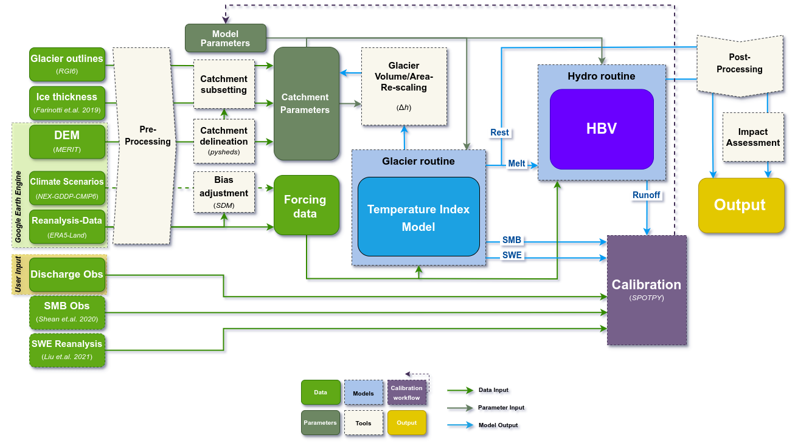

# MATILDA-Online: Workflow for Modeling Water Resources in Glacierized Catchments

[](https://mybinder.org/v2/gh/phiscu/matilda_edu/main?labpath=Notebook0_Introduction.ipynb) [](https://doi.org/10.5281/zenodo.15712744)

Welcome to **MATILDA-Online**, the online companion to the **MATILDA** glacio-hydrological modeling framework. This repository hosts the extended MATILDA workflow in form of a Jupyter Book. Designed for researchers, practitioners, and students, this workflow guides users from data acquisition to the analysis of climate change impacts on glacierized catchments.

📚 **Explore the Jupyter Book** on the [MATILDA-Online Website](https://matilda-online.github.io/jbook).

---

## Installation

You can run most of the workflow in an online environment hosted in mybinder.org. However, calibrating the model is computationally intensive and will be slow to run on a single CPU. For a comprehensive calibration, we recommend downloading the notebooks and running them on a local machine with multi-core processing capabilities.

To run the MATILDA-Online workflow locally, follow these steps:

1. Clone this repository to your local machine and navigate to its root folder:

```
git clone https://github.com/phiscu/matilda_online.git
cd matilda_online
```

2. Create and activate a Python environment using the provided environment.yml file. We recommend the use of conda:

```
conda env create -f environment.yml -n matilda_online
conda activate matilda_online
```

3. Install Jupyter Notebook or Jupyter Lab if not already installed:

```
conda -c conda-forge install jupyterlab
```

4. Launch the Jupyter Notebook interface:

```
jupyter lab
```

---

## Workflow Overview

The MATILDA-Online workflow is organized into a series of interactive Jupyter notebooks. These cover all key steps of modeling water resources in glacierized catchments, including catchment delineation, data acquisition, model calibration, and scenario analysis.

The workflow is divided into a series of interactive notebooks, each focused on a specific component of the modeling process. These notebooks streamline complex tasks such as catchment delineation, data processing, model calibration, and climate scenario analysis, ensuring clarity and reproducibility at each step:

- **[Notebook 0 - Introduction](https://matilda-online.github.io/jbook/Notebook0_Introduction.html):**

- **[Notebook 1 - Catchment Delineation](https://matilda-online.github.io/jbook/Notebook1_Catchment_delineation.html):** Delineate your catchment and retrieve static geospatial data, including digital elevation models, glacier outlines, and ice thickness distributions.
- **[Notebook 2 - Forcing Data](https://matilda-online.github.io/jbook/Notebook2_Forcing_data.html):** Acquire and process ERA5-Land reanalysis data, preparing inputs for glacio-hydrological model calibration.

- **[Notebook 3 - CMIP6 Climate Data](https://matilda-online.github.io/jbook/Notebook3_CMIP6.html):** Download and process historical and future climate data from the Coupled Model Intercomparison Project Phase 6 (CMIP6) for two emission scenarios.

- **[Notebook 4 - MATILDA Model](https://matilda-online.github.io/jbook/Notebook4_MATILDA.html):** Run the MATILDA model with default parameters and calibrate it based on mutiple objectives.

- **[Notebook 5 - Scenario Simulations](https://matilda-online.github.io/jbook/Notebook5_MATILDA_scenarios.html):** Apply your calibrated parameter set to run the model over all CMIP6 ensemble members for robust scenario-based analysis.

- **[Notebook 6 - Result Analysis & Impact Assessment](https://matilda-online.github.io/jbook/Notebook6_Analysis.html):** Visualize model output in interactive plots across ensemble simulations, extract key meteorological and hydrological indicators of of climate change impacts, and create a visual summary.

The workflow below is demonstrated using a sample site in the Tian Shan Mountains of Kyrgyzstan. To try the toolkit for yourself, simply click on the rocket icon in the toolbar above to launch an online environment hosted by [mybinder.org](https://mybinder.org/). There you can run any notebook with the sample data or upload your own and edit the config file accordingly. Note that while most of the workflow will work fine in the binder, calibrating the model is computationally intensive and will be slow to run on a single CPU. For a comprehensive calibration that takes full advantage of the [spotpy](https://spotpy.readthedocs.io/en/latest/) library, we recommend downloading the notebooks and running them on a local machine with multi-core processing capabilities. Additional options to reduce calibration time are described in Notebook 4.

Have fun exploring and happy modeling!

Below is a detailed flowchart of the workflow:



---

## Core Routines

The core routines of MATILDA, including the temperature-index melt model and HBV hydrological model, are maintained in the [MATILDA repository](https://github.com/cryotools/matilda). The MATILDA-Online workflow integrates these routines into a streamlined educational framework.

---

## Authors

- **Alexander Georgi** ([GitHub](https://github.com/geoalxx))
- **Phillip Schuster** ([GitHub](https://github.com/phiscu))
- **Mia Janzen** ([Github](https://github.com/hoepke))

---

## License

This project is licensed under the **MIT License**. See the [LICENSE](LICENSE) file for details.
